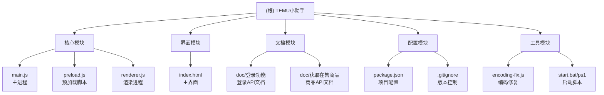

# TEMU小助手 - AI 上下文文档

## 变更记录 (Changelog)

### 2025-09-09 22:57:17
- **初始化 AI 上下文**：创建项目架构文档和模块索引
- **生成模块结构图**：添加 Mermaid 可视化项目结构
- **建立文档体系**：创建根级和模块级 CLAUDE.md 文档

---

## 项目愿景

TEMU小助手是一款基于 Electron 的跨境电商管理桌面应用，专为 TEMU 平台卖家设计。通过智能化的双层 Cookie 管理机制和多站点支持，为卖家提供便捷、安全、高效的店铺管理功能。项目致力于简化复杂的多站点认证流程，提供一站式的电商运营工具集。

## 架构总览

### 技术栈
- **框架**：Electron 27.0.0（跨平台桌面应用）
- **前端**：原生 HTML5 + CSS3 + JavaScript（无框架依赖）
- **进程通信**：IPC（主进程与渲染进程通信）
- **网络请求**：Electron net 模块
- **状态管理**：基于事件驱动的状态同步

### 核心架构特点
- **进程隔离**：主进程负责系统交互，渲染进程负责UI展示
- **安全设计**：禁用 nodeIntegration，启用 contextIsolation
- **双层认证**：自动管理跨境卖货平台和 TEMU 站点的 Cookie
- **智能窗口管理**：自动处理新窗口创建和站点跳转

## 模块结构图



## 模块索引

| 模块名称 | 路径 | 职责描述 | 主要文件 | 状态 |
|---------|------|----------|----------|------|
| 核心模块 | `./` | 主进程、渲染进程和预加载脚本 | main.js, renderer.js, preload.js | ✅ 完整 |
| 界面模块 | `./` | 用户界面和样式定义 | index.html | ✅ 完整 |
| 登录功能 | `doc/登录功能/` | 登录API和流程文档 | 登录API.md | ✅ 完整 |
| 在售商品 | `doc/获取在售商品/` | 商品API文档 | 获取在售商品.md | ✅ 完整 |
| 工具模块 | `./` | 编码修复和启动脚本 | encoding-fix.js, *.bat, *.ps1 | ✅ 完整 |

## 运行与开发

### 环境要求
- **Node.js**：14.0+ 
- **操作系统**：Windows 7/10/11, macOS 10.10+
- **网络**：稳定的互联网连接

### 快速启动
```bash
# 安装依赖
npm install

# 开发模式
npm run dev

# 生产模式  
npm start

# 构建应用
npm run pack    # 仅打包
npm run dist    # 完整构建
```

### 启动脚本
- `start.bat` / `start.ps1`：Windows 启动脚本，自动设置编码
- `dev.bat`：开发模式启动脚本

## 测试策略

### 当前状态
- **单元测试**：暂未实现
- **集成测试**：通过开发者工具手动测试
- **功能测试**：主要功能已验证

### 测试方案建议
1. **Cookie 管理测试**：验证双层 Cookie 获取和恢复
2. **站点跳转测试**：验证多站点切换流程
3. **UI 交互测试**：验证界面响应和状态同步
4. **网络请求测试**：验证 API 调用和错误处理

## 编码规范

### 代码风格
- **JavaScript**：ES6+ 语法，遵循 Standard Style
- **HTML/CSS**：语义化标签，响应式设计
- **命名规范**：驼峰命名法，语义化命名

### 文件组织
- **单一职责**：每个模块专注单一功能
- **清晰分层**：主进程、渲染进程、预加载脚本分离
- **模块化**：通过 IPC 实现模块间通信

### 安全要求
- **进程隔离**：禁用 nodeIntegration
- **上下文隔离**：启用 contextIsolation  
- **最小权限**：仅暴露必要的 API

## AI 使用指引

### 项目理解要点
1. **双层认证机制**：理解跨境卖货平台→站点选择→TEMU站点的完整流程
2. **Electron 架构**：掌握主进程与渲染进程的职责分工
3. **Cookie 管理**：理解两层 Cookie 的获取、存储和使用场景
4. **异步处理**：掌握基于 Promise 的异步流程控制

### 常用调试方法
- **主进程调试**：查看控制台输出
- **渲染进程调试**：使用内置开发者工具
- **Cookie 查看**：通过全局变量 `global.savedCookies` 和 `global.temuCookies`
- **API 测试**：通过控制台直接调用

### 开发建议
1. **功能扩展**：基于现有的 IPC 通信机制添加新功能
2. **UI 优化**：保持响应式设计和一致的视觉风格
3. **错误处理**：完善异常捕获和用户提示
4. **性能优化**：避免阻塞主进程，合理使用异步操作

### 关键文件速查
- **主要逻辑**：`main.js` （窗口管理、Cookie处理、站点切换）
- **用户界面**：`renderer.js` + `index.html` （UI交互、状态管理）
- **安全桥接**：`preload.js` （进程间通信）
- **API 文档**：`doc/` 目录下的 Markdown 文件